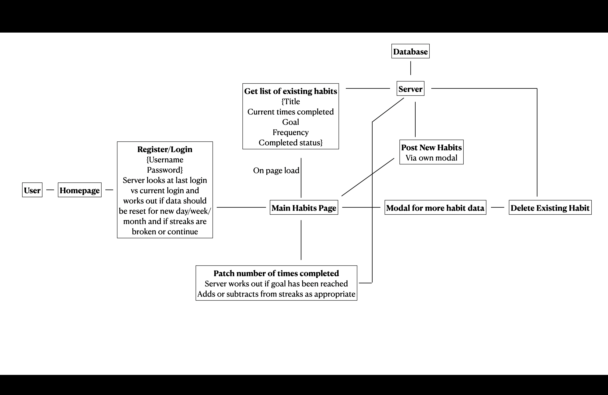

# Habit Maker

## About the Project

### An Overview

This project, Habit Maker, is a full stack application that allows users to create and track their own habits to enable the formation of good habits or rejection of bad ones. Habits are created with a target to reach in a given time. For example, you may want to read 3 books a month. Everytime you read a book, you can mark it up. If you hit 3 by the end of the month, you will complete your target and receive +1 to your streak. The streak will keep going until you fail to read 3 books in a month, or skip a month. This is all taken care of in the backend of the application automatically.

You can visit the live site at: [https://habit-makers.netlify.app/](https://habit-makers.netlify.app/){:target="_blank"}

### Project Approaches

Kanban boards were used to plan out the things to do, and testing was used to ensure the application worked as intended.

### When was this completed

This project was completed from the 8th to the 12th of October, 2022. The backend was based on work I had completed for a previous project. However, the React front-end was built from scratch for this challenge.

## Built With

- React
- Bootstrap
- React Bootstrap
- Node.js
- Express
- MongoDB
- MongoDB Atlas

## Getting Started

### Prerequisites

In order to run this project locally, I have used node v16.17.1.

### Installation

1. Clone this repository in your terminal: `git clone ...`

2. To setup the server installations locally, cd into 'server' folder: `cd server`

3. Install dependencies: `npm i -D`

4. To setup the client locally, cd into the 'client/habit-app' folder (client at same directory level as server): `cd client/habit-app`

5. Install dependencies: `npm i -D`

### Running

To run the server locally, cd into the 'server' folder and `npm run dev`

The server is available on `http://localhost:3001/`

To run the client locally, cd into the 'client/habit-app' folder and `npm run start`

The client is available on `http://localhost:3000/`

To run tests on the client, from 'habit-app' `npm run test`

### Project structure

The server folder contains primarily the controllers, models, and routes folders for the backend.

The habit-app folder in the client folder contains a public folder and the src folder which contains the pages and components folders that build up the site.

## Problem Statements

### Problem statement - requirements

Create an app which enables users to track habits they want to form. A front end should allow users to access and update information stored in a database so their progress can be tracked.

Requirements:
1. Full stack application
2. Persistence later
3. Testing

### User stories

1. Users should be able to create and log into an account so they can return to their personal tracked habits.
2. Users should be able to create new habits that they want to track.
3. Users should be able to set their own goals for the habits.
4. Users should be able to update their progress on their habits (update how many times it is done) so they can see how close they are to their goals.
5. Users should see a streak of how many times they complete their habit in a row to monitor progress and encourage keeping it up.
6. Users should be able to delete habits they are no loonger interested in.

### Domain Models

### Tests

Significant tests produced include:
- Register error handling for valid inputs
- Login error handling for valid inputs
- Create new habit error handling for valid inputs
- Server request on correct inputs
- Unit tests on existance of elements
- Modals rendering on relevant button clicks
- Requests for patch and delete on relevant button clicks
- Get request on main habit page load

## Project Review and Roadmap

[Work Log for this project](./worklog.md)

### Main takeaways

    - Worked more with state
    - Worked more with React Bootstrap Modals
    - Used Popovers for the first time
    - Improved knowledge of testing in React, used jest Mock
    - If done again, would do more tests earlier

### Where next?

- Could add ability to edit goals after habits are created
- Could add ability to freeze streaks for a certain time
- Could add achievement badges for certain accomplishments
- Could add ability to look back at previous times when goals were completed and have features such as longest streak ever which would require storing some more data in the database as well as server logic
- Could add a level system with experience points gained for completing streaks

## Acknowledgements

- Axios
- Jest
- Bcryptjs
- Stack Overflow
- W3 Schools
